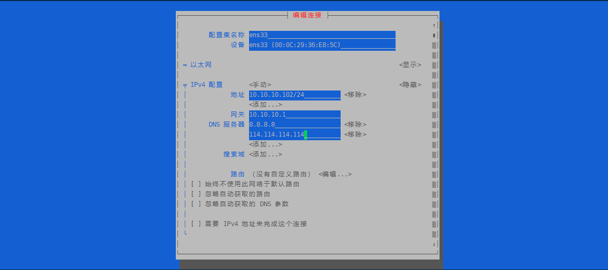

## 本页目录
[[toc]]

## 网络管理
### 查看网络
`ip address show` 或 `ip addr show` 或 `ip a`
```sh
[root@localhost ~]# ip a
1: lo: <LOOPBACK,UP,LOWER_UP> mtu 65536 qdisc noqueue state UNKNOWN group default qlen 1000
    link/loopback 00:00:00:00:00:00 brd 00:00:00:00:00:00
    inet 127.0.0.1/8 scope host lo
       valid_lft forever preferred_lft forever
    inet6 ::1/128 scope host 
       valid_lft forever preferred_lft forever
2: ens33: <BROADCAST,MULTICAST,UP,LOWER_UP> mtu 1500 qdisc pfifo_fast state UP group default qlen 1000
    link/ether 00:0c:29:36:e8:5c brd ff:ff:ff:ff:ff:ff
    inet 10.10.10.102/24 brd 10.10.10.255 scope global noprefixroute dynamic ens33
       valid_lft 1067sec preferred_lft 1067sec
    inet6 fe80::d01f:9003:5fe3:3753/64 scope link noprefixroute 
       valid_lft forever preferred_lft forever
[root@localhost ~]# 
```
`ifconfig`
```sh
[root@localhost ~]# ifconfig
ens33: flags=4163<UP,BROADCAST,RUNNING,MULTICAST>  mtu 1500
        inet 10.10.10.102  netmask 255.255.255.0  broadcast 10.10.10.255
        inet6 fe80::d01f:9003:5fe3:3753  prefixlen 64  scopeid 0x20<link>
        ether 00:0c:29:36:e8:5c  txqueuelen 1000  (Ethernet)
        RX packets 4508  bytes 358571 (350.1 KiB)
        RX errors 0  dropped 0  overruns 0  frame 0
        TX packets 6172  bytes 731199 (714.0 KiB)
        TX errors 0  dropped 0 overruns 0  carrier 0  collisions 0

lo: flags=73<UP,LOOPBACK,RUNNING>  mtu 65536
        inet 127.0.0.1  netmask 255.0.0.0
        inet6 ::1  prefixlen 128  scopeid 0x10<host>
        loop  txqueuelen 1000  (Local Loopback)
        RX packets 60  bytes 5004 (4.8 KiB)
        RX errors 0  dropped 0  overruns 0  frame 0
        TX packets 60  bytes 5004 (4.8 KiB)
        TX errors 0  dropped 0 overruns 0  carrier 0  collisions 0

[root@localhost ~]#
```

### 测试网络连通性
```sh
[root@localhost ~]# ping www.baidu.com
PING www.a.shifen.com (61.135.169.121) 56(84) bytes of data.
64 bytes from 61.135.169.121 (61.135.169.121): icmp_seq=1 ttl=128 time=39.7 ms
64 bytes from 61.135.169.121 (61.135.169.121): icmp_seq=2 ttl=128 time=39.7 ms
64 bytes from 61.135.169.121 (61.135.169.121): icmp_seq=3 ttl=128 time=38.8 ms
64 bytes from 61.135.169.121 (61.135.169.121): icmp_seq=4 ttl=128 time=39.3 ms
^C
--- www.a.shifen.com ping statistics ---
4 packets transmitted, 4 received, 0% packet loss, time 3005ms
rtt min/avg/max/mdev = 38.899/39.444/39.794/0.354 ms
[root@localhost ~]# 
```

### 网卡状态管理
```sh
systemctl start network # 启动
systemctl stop network # 关闭
systemctl restart network # 重启
```

### 配置网卡信息
#### 可视化编辑
```sh
[root@localhost ~]# nmtui
```
> 上下左右(tab键也可以左右切换)选择，回车确定




#### 终端编辑
```sh
[root@localhost ~]# vim /etc/sysconfig/network-scripts/ifcfg-ens33
```


## 远程工具
[FinallShell (本机)](http://www.hostbuf.com/)

[MobaXterm](https://mobaxterm.mobatek.net/)

[Putty](https://www.chiark.greenend.org.uk/~sgtatham/putty/latest.html)

......


<Valine />