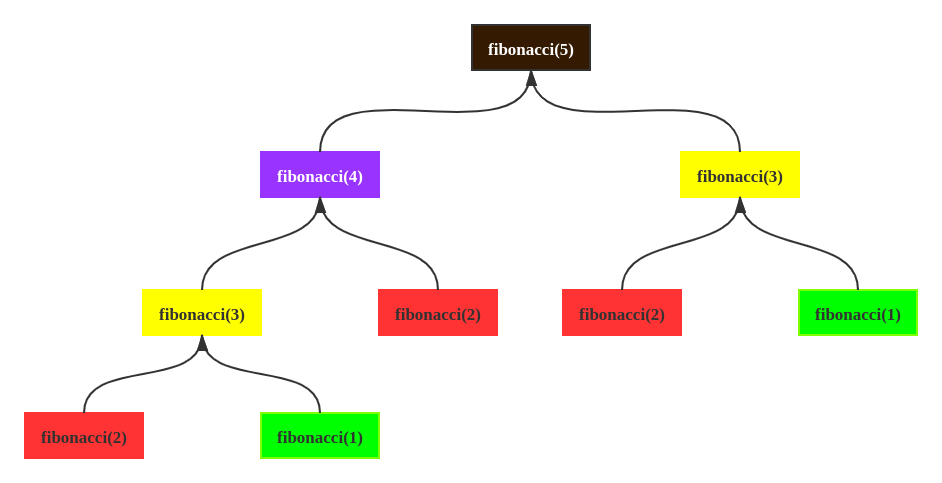

## 本页目录

[[toc]]

## 什么是算法

> 用于解决特定问题的一系列的执行步骤

### 特征

-   有穷性（Finiteness）
    > 算法的有穷性是指算法必须能在执行有限个步骤之后终止；
-   确切性(Definiteness)
    > 算法的每一步骤必须有确切的定义；
-   输入项(Input)
    > 一个算法有 0 个或多个输入，以刻画运算对象的初始情况，所谓 0 个输入是指算法本身定出了初始条件；
-   输出项(Output)
    > 一个算法有一个或多个输出，以反映对输入数据加工后的结果。没有输出的算法是毫无意义的；
-   可行性(Effectiveness)
    > 算法中执行的任何计算步骤都是可以被分解为基本的可执行的操作步骤，即每个计算步骤都可以在有限时间内完成（也称之为有效性）。

::: tip 例子

```c
int sum(int a, int b)
{
    return a + b;
}

double factorial(int n)
{
    double sum = 1;
    for (int i = 1; i <= n; i++)
        sum = sum * i;
    return sum;
}
```

:::

### 案例

::: tip 求第 n 个斐波那契数（JAVA）

```java
public static void main(String[] args) {
    long start;
    long end;
    start = System.currentTimeMillis();
    System.out.println(fibonacci_1(40));
    end = System.currentTimeMillis();
    System.out.println((end - start) + " ms");
    /**
    * 102334155
    * 425 ms
    */

    start = System.currentTimeMillis();
    System.out.println(fibonacci_2(40));
    end = System.currentTimeMillis();
    System.out.println((end - start) + " ms");
    /**
    * 102334155
    * 0 ms
    */
}

public static long fibonacci_1(long n) {
    if (n <= 1) return n;
    return fibonacci_1(n - 1) + fibonacci_1(n - 2);
}

public static long fibonacci_2(long n) {
    if (n <= 1) return n;
    long first = 0;
    long second = 1;
    long sum = 0;
    for (int i = 0; i < n - 1; i++) {
        sum = first + second;
        first = second;
        second = sum;
    }
    return sum;
}
```

:::

#### 递归算法示意图



## 判断一个算法的好坏

-   正确,可读,健壮
-   时间复杂度(time complexity)
    -   O(1) < O(logn) < O(n) < O(nlogn) < O(n^2) < O(n^3) < O(2^n) < O(n!) < O(n^n)
    -   一般情况下,当 时间复杂度 >= O(n^2), 就应该考虑算法问题
-   空间复杂度(space complexity)


## 优化方向
- 减少占用存储空间
- 较少程序执行时间
- 空间换时间
- 时间换空间

## 练习算法

[https://leetcode.com/](https://leetcode.com/)

[https://leetcode-cn.com/](https://leetcode-cn.com/)

[https://www.lintcode.com](http://www.lintcode.com)

[https://www.topcoder.com](https://www.topcoder.com)

[https://www.geeksforgeeks.org](http://www.geeksforgeeks.org)

[https://github.com/Dev-XYS/Algorithms](https://github.com/Dev-XYS/Algorithms)

<Valine />
