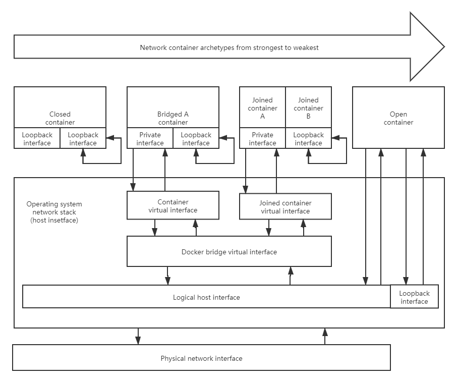

## 本页目录

[[toc]]
::: tip

#### 非 root 用户 请添加 sudo

:::

## Docker 网络驱动模型

[官方文档](https://docs.docker.com/) 给出了以下五种网络驱动模型:

-   **bridge**：网桥类型网络，实际上是五大虚拟网络中的 `NAT网络`，在 Docker 中叫做 `bridge` 网桥类型
-   **host**：主机类型网络，原理是容器使用宿主机的网络命名空间，因此会直接看到并使用宿主机的所有网络功能，在 Docker 中叫做 `host` 网络驱动
-   **none**：禁用容器网络，在容器中仅有 `lo` 网卡用于本地回环地址通信
-   **overlay**：叠加网络，借助 `docker swarn` 服务实现的高级叠加网络模型
-   **macvlan**：在 `macvlan` 网络模式下，可以把 `MAC` 地址分配给某个容器，这样 Docker 容器可以直接通过 `MAC` 地址进行路由传输，这样就不在依靠 `docker host` 进行转发，提高报文处理效率


图中 `Closed container` 对应 `none` 网络模型，`Bridged container` 对应 `bridge` 网络模型，`Joined container` 对应 `container` 网络模型，`Open container` 对应 `host` 网络模型

## Docker 网络模型信息

### 查看容器 ip

```sh
docker container inspect --format='{{.Name}} - {{range.NetworkSettings.Networks}}{{.IPAddress}}{{end}}' $(docker ps -aq)
```

### 帮助命令

```sh
[root@localhost ~]# docker network --help

Usage:  docker network COMMAND

Manage networks

Commands:
  connect     Connect a container to a network
  create      Create a network
  disconnect  Disconnect a container from a network
  inspect     Display detailed information on one or more networks
  ls          List networks
  prune       Remove all unused networks
  rm          Remove one or more networks

Run 'docker network COMMAND --help' for more information on a command.
[root@localhost ~]#
```

### 网络模型操作

`docker network list`|`docker network ls` 显示所有网桥

```sh
[root@localhost ~]# docker network list
NETWORK ID          NAME                DRIVER              SCOPE
5f9e20e352ca        bridge              bridge              local
06963bc16e22        host                host                local
8eeba124466c        none                null                local
[root@localhost ~]#
```

`docker inspect NETWORK_NAME` 查看单一网桥详细信息

```sh
[root@localhost ~]# docker inspect bridge
[
    {
        "Name": "bridge",
        "Id": "5f9e20e352ca2ac7b61427bc07b8e54a827a0d91cfab69af9ee3ce987850efc7",
        "Created": "2019-12-27T01:22:56.126166181-05:00",
        "Scope": "local",
        "Driver": "bridge",
        "EnableIPv6": false,
        "IPAM": {
            "Driver": "default",
            "Options": null,
            "Config": [
                {
                    "Subnet": "172.17.0.0/16",
                    "Gateway": "172.17.0.1"
                }
            ]
        },
        "Internal": false,
        "Attachable": false,
        "Ingress": false,
        "ConfigFrom": {
            "Network": ""
        },
        "ConfigOnly": false,
        "Containers": {},
        "Options": {
            "com.docker.network.bridge.default_bridge": "true",
            "com.docker.network.bridge.enable_icc": "true",
            "com.docker.network.bridge.enable_ip_masquerade": "true",
            "com.docker.network.bridge.host_binding_ipv4": "0.0.0.0",
            "com.docker.network.bridge.name": "docker0",
            "com.docker.network.driver.mtu": "1500"
        },
        "Labels": {}
    }
]
[root@localhost ~]#
```

### 查看网桥

#### bridge 网桥(默认)


```sh
[root@localhost ~]# docker run --rm -it centos /bin/sh
sh-4.4# ip addr show
1: lo: <LOOPBACK,UP,LOWER_UP> mtu 65536 qdisc noqueue state UNKNOWN group default qlen 1000
    link/loopback 00:00:00:00:00:00 brd 00:00:00:00:00:00
    inet 127.0.0.1/8 scope host lo
       valid_lft forever preferred_lft forever
6: eth0@if7: <BROADCAST,MULTICAST,UP,LOWER_UP> mtu 1500 qdisc noqueue state UP group default
    link/ether 02:42:ac:11:00:03 brd ff:ff:ff:ff:ff:ff link-netnsid 0
    inet 172.17.0.3/16 brd 172.17.255.255 scope global eth0
       valid_lft forever preferred_lft forever
sh-4.4#

# ctrl + p + q

[root@localhost ~]# docker run --rm -it centos /bin/sh
sh-4.4# ip addr show
1: lo: <LOOPBACK,UP,LOWER_UP> mtu 65536 qdisc noqueue state UNKNOWN group default qlen 1000
    link/loopback 00:00:00:00:00:00 brd 00:00:00:00:00:00
    inet 127.0.0.1/8 scope host lo
       valid_lft forever preferred_lft forever
4: eth0@if5: <BROADCAST,MULTICAST,UP,LOWER_UP> mtu 1500 qdisc noqueue state UP group default
    link/ether 02:42:ac:11:00:02 brd ff:ff:ff:ff:ff:ff link-netnsid 0
    inet 172.17.0.2/16 brd 172.17.255.255 scope global eth0
       valid_lft forever preferred_lft forever
sh-4.4#

# ctrl + p + q

[root@localhost ~]# ip addr show
1: lo: <LOOPBACK,UP,LOWER_UP> mtu 65536 qdisc noqueue state UNKNOWN group default qlen 1000
    link/loopback 00:00:00:00:00:00 brd 00:00:00:00:00:00
    inet 127.0.0.1/8 scope host lo
       valid_lft forever preferred_lft forever
    inet6 ::1/128 scope host
       valid_lft forever preferred_lft forever
2: ens33: <BROADCAST,MULTICAST,UP,LOWER_UP> mtu 1500 qdisc pfifo_fast state UP group default qlen 1000
    link/ether 00:0c:29:7f:1f:ca brd ff:ff:ff:ff:ff:ff
    inet 10.10.7.105/24 brd 10.10.7.255 scope global noprefixroute dynamic ens33
       valid_lft 85217sec preferred_lft 85217sec
    inet6 fe80::c5ca:704f:ede0:d8c5/64 scope link noprefixroute
       valid_lft forever preferred_lft forever
3: docker0: <BROADCAST,MULTICAST,UP,LOWER_UP> mtu 1500 qdisc noqueue state UP group default
    link/ether 02:42:27:e7:62:bf brd ff:ff:ff:ff:ff:ff
    inet 172.17.0.1/16 brd 172.17.255.255 scope global docker0
       valid_lft forever preferred_lft forever
    inet6 fe80::42:27ff:fee7:62bf/64 scope link
       valid_lft forever preferred_lft forever
5: vethc43b0f6@if4: <BROADCAST,MULTICAST,UP,LOWER_UP> mtu 1500 qdisc noqueue master docker0 state UP group default
    link/ether 72:1c:a4:05:6e:fe brd ff:ff:ff:ff:ff:ff link-netnsid 0
    inet6 fe80::701c:a4ff:fe05:6efe/64 scope link
       valid_lft forever preferred_lft forever
7: veth60b56d7@if6: <BROADCAST,MULTICAST,UP,LOWER_UP> mtu 1500 qdisc noqueue master docker0 state UP group default
    link/ether 9e:63:d0:9b:76:9b brd ff:ff:ff:ff:ff:ff link-netnsid 1
    inet6 fe80::9c63:d0ff:fe9b:769b/64 scope link
       valid_lft forever preferred_lft forever
[root@localhost ~]# docker ps
CONTAINER ID        IMAGE               COMMAND             CREATED             STATUS              PORTS               NAMES
177cfbf77a20        centos              "/bin/sh"           6 seconds ago       Up 5 seconds                            optimistic_visvesvaraya
c45446f89fd0        centos              "/bin/sh"           21 seconds ago      Up 20 seconds                           dazzling_sammet
[root@localhost ~]# ifconfig
docker0: flags=4163<UP,BROADCAST,RUNNING,MULTICAST>  mtu 1500
        inet 172.17.0.1  netmask 255.255.0.0  broadcast 172.17.255.255
        inet6 fe80::42:27ff:fee7:62bf  prefixlen 64  scopeid 0x20<link>
        ether 02:42:27:e7:62:bf  txqueuelen 0  (Ethernet)
        RX packets 0  bytes 0 (0.0 B)
        RX errors 0  dropped 0  overruns 0  frame 0
        TX packets 8  bytes 656 (656.0 B)
        TX errors 0  dropped 0 overruns 0  carrier 0  collisions 0

ens33: flags=4163<UP,BROADCAST,RUNNING,MULTICAST>  mtu 1500
        inet 10.10.7.105  netmask 255.255.255.0  broadcast 10.10.7.255
        inet6 fe80::c5ca:704f:ede0:d8c5  prefixlen 64  scopeid 0x20<link>
        ether 00:0c:29:7f:1f:ca  txqueuelen 1000  (Ethernet)
        RX packets 2277  bytes 233023 (227.5 KiB)
        RX errors 0  dropped 0  overruns 0  frame 0
        TX packets 611  bytes 69168 (67.5 KiB)
        TX errors 0  dropped 0 overruns 0  carrier 0  collisions 0

lo: flags=73<UP,LOOPBACK,RUNNING>  mtu 65536
        inet 127.0.0.1  netmask 255.0.0.0
        inet6 ::1  prefixlen 128  scopeid 0x10<host>
        loop  txqueuelen 1000  (Local Loopback)
        RX packets 68  bytes 5904 (5.7 KiB)
        RX errors 0  dropped 0  overruns 0  frame 0
        TX packets 68  bytes 5904 (5.7 KiB)
        TX errors 0  dropped 0 overruns 0  carrier 0  collisions 0

veth60b56d7: flags=4163<UP,BROADCAST,RUNNING,MULTICAST>  mtu 1500
        inet6 fe80::9c63:d0ff:fe9b:769b  prefixlen 64  scopeid 0x20<link>
        ether 9e:63:d0:9b:76:9b  txqueuelen 0  (Ethernet)
        RX packets 0  bytes 0 (0.0 B)
        RX errors 0  dropped 0  overruns 0  frame 0
        TX packets 8  bytes 656 (656.0 B)
        TX errors 0  dropped 0 overruns 0  carrier 0  collisions 0

vethc43b0f6: flags=4163<UP,BROADCAST,RUNNING,MULTICAST>  mtu 1500
        inet6 fe80::701c:a4ff:fe05:6efe  prefixlen 64  scopeid 0x20<link>
        ether 72:1c:a4:05:6e:fe  txqueuelen 0  (Ethernet)
        RX packets 0  bytes 0 (0.0 B)
        RX errors 0  dropped 0  overruns 0  frame 0
        TX packets 16  bytes 1312 (1.2 KiB)
        TX errors 0  dropped 0 overruns 0  carrier 0  collisions 0

[root@localhost ~]# yum install -y bridge-utils
......
Installed:
  bridge-utils.x86_64 0:1.5-9.el7

Complete!
[root@localhost ~]# brctl show
bridge name     bridge id               STP enabled     interfaces
docker0         8000.024227e762bf       no              veth60b56d7
                                                        vethc43b0f6
[root@localhost ~]#
```

#### host 网桥

```sh
[root@localhost ~]# docker run -it --network host centos /bin/sh
sh-4.4# ip addr show
1: lo: <LOOPBACK,UP,LOWER_UP> mtu 65536 qdisc noqueue state UNKNOWN group default qlen 1000
    link/loopback 00:00:00:00:00:00 brd 00:00:00:00:00:00
    inet 127.0.0.1/8 scope host lo
       valid_lft forever preferred_lft forever
    inet6 ::1/128 scope host
       valid_lft forever preferred_lft forever
2: ens33: <BROADCAST,MULTICAST,UP,LOWER_UP> mtu 1500 qdisc pfifo_fast state UP group default qlen 1000
    link/ether 00:0c:29:7f:1f:ca brd ff:ff:ff:ff:ff:ff
    inet 10.10.7.105/24 brd 10.10.7.255 scope global dynamic noprefixroute ens33
       valid_lft 84471sec preferred_lft 84471sec
    inet6 fe80::c5ca:704f:ede0:d8c5/64 scope link noprefixroute
       valid_lft forever preferred_lft forever
3: docker0: <BROADCAST,MULTICAST,UP,LOWER_UP> mtu 1500 qdisc noqueue state UP group default
    link/ether 02:42:27:e7:62:bf brd ff:ff:ff:ff:ff:ff
    inet 172.17.0.1/16 brd 172.17.255.255 scope global docker0
       valid_lft forever preferred_lft forever
    inet6 fe80::42:27ff:fee7:62bf/64 scope link
       valid_lft forever preferred_lft forever
5: vethc43b0f6@if4: <BROADCAST,MULTICAST,UP,LOWER_UP> mtu 1500 qdisc noqueue master docker0 state UP group default
    link/ether 72:1c:a4:05:6e:fe brd ff:ff:ff:ff:ff:ff link-netnsid 0
    inet6 fe80::701c:a4ff:fe05:6efe/64 scope link
       valid_lft forever preferred_lft forever
7: veth60b56d7@if6: <BROADCAST,MULTICAST,UP,LOWER_UP> mtu 1500 qdisc noqueue master docker0 state UP group default
    link/ether 9e:63:d0:9b:76:9b brd ff:ff:ff:ff:ff:ff link-netnsid 1
    inet6 fe80::9c63:d0ff:fe9b:769b/64 scope link
       valid_lft forever preferred_lft forever
sh-4.4# hostname
localhost.localdomain
sh-4.4# yum install -y net-tools
......
Installed:
  net-tools-2.0-0.51.20160912git.el8.x86_64

Complete!
sh-4.4# ifconfig
docker0: flags=4163<UP,BROADCAST,RUNNING,MULTICAST>  mtu 1500
        inet 172.17.0.1  netmask 255.255.0.0  broadcast 172.17.255.255
        inet6 fe80::42:27ff:fee7:62bf  prefixlen 64  scopeid 0x20<link>
        ether 02:42:27:e7:62:bf  txqueuelen 0  (Ethernet)
        RX packets 6  bytes 392 (392.0 B)
        RX errors 0  dropped 0  overruns 0  frame 0
        TX packets 17  bytes 1258 (1.2 KiB)
        TX errors 0  dropped 0 overruns 0  carrier 0  collisions 0

ens33: flags=4163<UP,BROADCAST,RUNNING,MULTICAST>  mtu 1500
        inet 10.10.7.105  netmask 255.255.255.0  broadcast 10.10.7.255
        inet6 fe80::c5ca:704f:ede0:d8c5  prefixlen 64  scopeid 0x20<link>
        ether 00:0c:29:7f:1f:ca  txqueuelen 1000  (Ethernet)
        RX packets 16538  bytes 16569836 (15.8 MiB)
        RX errors 0  dropped 0  overruns 0  frame 0
        TX packets 5182  bytes 412218 (402.5 KiB)
        TX errors 0  dropped 0 overruns 0  carrier 0  collisions 0

lo: flags=73<UP,LOOPBACK,RUNNING>  mtu 65536
        inet 127.0.0.1  netmask 255.0.0.0
        inet6 ::1  prefixlen 128  scopeid 0x10<host>
        loop  txqueuelen 1000  (Local Loopback)
        RX packets 70  bytes 6128 (5.9 KiB)
        RX errors 0  dropped 0  overruns 0  frame 0
        TX packets 70  bytes 6128 (5.9 KiB)
        TX errors 0  dropped 0 overruns 0  carrier 0  collisions 0

veth60b56d7: flags=4163<UP,BROADCAST,RUNNING,MULTICAST>  mtu 1500
        inet6 fe80::9c63:d0ff:fe9b:769b  prefixlen 64  scopeid 0x20<link>
        ether 9e:63:d0:9b:76:9b  txqueuelen 0  (Ethernet)
        RX packets 3  bytes 238 (238.0 B)
        RX errors 0  dropped 0  overruns 0  frame 0
        TX packets 15  bytes 1062 (1.0 KiB)
        TX errors 0  dropped 0 overruns 0  carrier 0  collisions 0

vethc43b0f6: flags=4163<UP,BROADCAST,RUNNING,MULTICAST>  mtu 1500
        inet6 fe80::701c:a4ff:fe05:6efe  prefixlen 64  scopeid 0x20<link>
        ether 72:1c:a4:05:6e:fe  txqueuelen 0  (Ethernet)
        RX packets 3  bytes 238 (238.0 B)
        RX errors 0  dropped 0  overruns 0  frame 0
        TX packets 23  bytes 1718 (1.6 KiB)
        TX errors 0  dropped 0 overruns 0  carrier 0  collisions 0

sh-4.4#
```

#### none 网桥

```sh
[root@localhost ~]# docker run -it --network none centos /bin/sh
sh-4.4# ip addr show
1: lo: <LOOPBACK,UP,LOWER_UP> mtu 65536 qdisc noqueue state UNKNOWN group default qlen 1000
    link/loopback 00:00:00:00:00:00 brd 00:00:00:00:00:00
    inet 127.0.0.1/8 scope host lo
       valid_lft forever preferred_lft forever
sh-4.4#
```

## 创建网桥

```sh
[root@localhost ~]# docker network list
NETWORK ID          NAME                DRIVER              SCOPE
5f9e20e352ca        bridge              bridge              local
06963bc16e22        host                host                local
8eeba124466c        none                null                local
[root@localhost ~]# ifconfig
docker0: flags=4163<UP,BROADCAST,RUNNING,MULTICAST>  mtu 1500
        inet 172.17.0.1  netmask 255.255.0.0  broadcast 172.17.255.255
        inet6 fe80::42:27ff:fee7:62bf  prefixlen 64  scopeid 0x20<link>
        ether 02:42:27:e7:62:bf  txqueuelen 0  (Ethernet)
        RX packets 6  bytes 392 (392.0 B)
        RX errors 0  dropped 0  overruns 0  frame 0
        TX packets 17  bytes 1258 (1.2 KiB)
        TX errors 0  dropped 0 overruns 0  carrier 0  collisions 0

ens33: flags=4163<UP,BROADCAST,RUNNING,MULTICAST>  mtu 1500
......

lo: flags=73<UP,LOOPBACK,RUNNING>  mtu 65536
......

[root@localhost ~]# docker network create new-bridge
74476e4cf2b42614eaf0575a2487249ebb2c213ff3544bba2f173f07a1f0c402
[root@localhost ~]# docker network list
NETWORK ID          NAME                DRIVER              SCOPE
5f9e20e352ca        bridge              bridge              local
06963bc16e22        host                host                local
74476e4cf2b4        new-bridge          bridge              local
8eeba124466c        none                null                local
[root@localhost ~]# ifconfig
br-74476e4cf2b4: flags=4099<UP,BROADCAST,MULTICAST>  mtu 1500
        inet 172.18.0.1  netmask 255.255.0.0  broadcast 172.18.255.255
        ether 02:42:25:2e:52:5f  txqueuelen 0  (Ethernet)
        RX packets 0  bytes 0 (0.0 B)
        RX errors 0  dropped 0  overruns 0  frame 0
        TX packets 0  bytes 0 (0.0 B)
        TX errors 0  dropped 0 overruns 0  carrier 0  collisions 0

docker0: flags=4163<UP,BROADCAST,RUNNING,MULTICAST>  mtu 1500
        inet 172.17.0.1  netmask 255.255.0.0  broadcast 172.17.255.255
        inet6 fe80::42:27ff:fee7:62bf  prefixlen 64  scopeid 0x20<link>
        ether 02:42:27:e7:62:bf  txqueuelen 0  (Ethernet)
        RX packets 6  bytes 392 (392.0 B)
        RX errors 0  dropped 0  overruns 0  frame 0
        TX packets 17  bytes 1258 (1.2 KiB)
        TX errors 0  dropped 0 overruns 0  carrier 0  collisions 0

ens33: flags=4163<UP,BROADCAST,RUNNING,MULTICAST>  mtu 1500
......

lo: flags=73<UP,LOOPBACK,RUNNING>  mtu 65536
......

[root@localhost ~]# docker network create --gateway="10.10.10.1" --subnet="10.10.0.0/16" --ip-range="10.10.10.0/24" appoint-bridge
35ae5ce0537331770365dc76bdc0ba23a1fef75245906f45e138e3b8aeae45cb
[root@localhost ~]# docker network list
NETWORK ID          NAME                DRIVER              SCOPE
35ae5ce05373        appoint-bridge      bridge              local
5f9e20e352ca        bridge              bridge              local
06963bc16e22        host                host                local
74476e4cf2b4        new-bridge          bridge              local
8eeba124466c        none                null                local
[root@localhost ~]# docker inspect appoint-bridge
[
    {
        "Name": "appoint-bridge",
        "Id": "35ae5ce0537331770365dc76bdc0ba23a1fef75245906f45e138e3b8aeae45cb",
        "Created": "2019-12-27T02:26:19.946678077-05:00",
        "Scope": "local",
        "Driver": "bridge",
        "EnableIPv6": false,
        "IPAM": {
            "Driver": "default",
            "Options": {},
            "Config": [
                {
                    "Subnet": "10.10.0.0/16",
                    "IPRange": "10.10.10.0/24",
                    "Gateway": "10.10.10.1"
                }
            ]
        },
        "Internal": false,
        "Attachable": false,
        "Ingress": false,
        "ConfigFrom": {
            "Network": ""
        },
        "ConfigOnly": false,
        "Containers": {},
        "Options": {},
        "Labels": {}
    }
]
[root@localhost ~]# ifconfig
br-35ae5ce05373: flags=4099<UP,BROADCAST,MULTICAST>  mtu 1500
        inet 10.10.10.1  netmask 255.255.0.0  broadcast 10.10.255.255
        ether 02:42:c3:4b:b5:8b  txqueuelen 0  (Ethernet)
        RX packets 0  bytes 0 (0.0 B)
        RX errors 0  dropped 0  overruns 0  frame 0
        TX packets 0  bytes 0 (0.0 B)
        TX errors 0  dropped 0 overruns 0  carrier 0  collisions 0

br-74476e4cf2b4: flags=4099<UP,BROADCAST,MULTICAST>  mtu 1500
        inet 172.18.0.1  netmask 255.255.0.0  broadcast 172.18.255.255
        ether 02:42:25:2e:52:5f  txqueuelen 0  (Ethernet)
        RX packets 0  bytes 0 (0.0 B)
        RX errors 0  dropped 0  overruns 0  frame 0
        TX packets 0  bytes 0 (0.0 B)
        TX errors 0  dropped 0 overruns 0  carrier 0  collisions 0

docker0: flags=4099<UP,BROADCAST,MULTICAST>  mtu 1500
        inet 172.17.0.1  netmask 255.255.0.0  broadcast 172.17.255.255
        inet6 fe80::42:27ff:fee7:62bf  prefixlen 64  scopeid 0x20<link>
        ether 02:42:27:e7:62:bf  txqueuelen 0  (Ethernet)
        RX packets 6  bytes 392 (392.0 B)
        RX errors 0  dropped 0  overruns 0  frame 0
        TX packets 17  bytes 1258 (1.2 KiB)
        TX errors 0  dropped 0 overruns 0  carrier 0  collisions 0

ens33: flags=4163<UP,BROADCAST,RUNNING,MULTICAST>  mtu 1500
......

lo: flags=73<UP,LOOPBACK,RUNNING>  mtu 65536
......

[root@localhost ~]#
```

### 创建指定 网桥 和 ip 的容器

```sh
[root@localhost ~]# docker run -it --network=appoint-bridge --ip=10.10.10.2 centos /bin/bash
[root@4af03148e740 /]# ip addr show
1: lo: <LOOPBACK,UP,LOWER_UP> mtu 65536 qdisc noqueue state UNKNOWN group default qlen 1000
    link/loopback 00:00:00:00:00:00 brd 00:00:00:00:00:00
    inet 127.0.0.1/8 scope host lo
       valid_lft forever preferred_lft forever
12: eth0@if13: <BROADCAST,MULTICAST,UP,LOWER_UP> mtu 1500 qdisc noqueue state UP group default
    link/ether 02:42:0a:0a:0a:02 brd ff:ff:ff:ff:ff:ff link-netnsid 0
    inet 10.10.10.2/16 brd 10.10.255.255 scope global eth0
       valid_lft forever preferred_lft forever
[root@4af03148e740 /]# yum install -y net-tools
......
Installed:
  net-tools-2.0-0.51.20160912git.el8.x86_64

Complete!
[root@4af03148e740 /]# ifconfig
eth0: flags=4163<UP,BROADCAST,RUNNING,MULTICAST>  mtu 1500
        inet 10.10.10.2  netmask 255.255.0.0  broadcast 10.10.255.255
        ether 02:42:0a:0a:0a:02  txqueuelen 0  (Ethernet)
        RX packets 5247  bytes 15600863 (14.8 MiB)
        RX errors 0  dropped 0  overruns 0  frame 0
        TX packets 4397  bytes 309925 (302.6 KiB)
        TX errors 0  dropped 0 overruns 0  carrier 0  collisions 0

lo: flags=73<UP,LOOPBACK,RUNNING>  mtu 65536
        inet 127.0.0.1  netmask 255.0.0.0
        loop  txqueuelen 1000  (Local Loopback)
        RX packets 170  bytes 14628 (14.2 KiB)
        RX errors 0  dropped 0  overruns 0  frame 0
        TX packets 170  bytes 14628 (14.2 KiB)
        TX errors 0  dropped 0 overruns 0  carrier 0  collisions 0

[root@4af03148e740 /]#
# ctrl + p + q
```

### 给容器添加或移除网络

```sh
[root@localhost ~]# docker ps -a
CONTAINER ID        IMAGE               COMMAND             CREATED             STATUS              PORTS               NAMES
4af03148e740        centos              "/bin/bash"         3 minutes ago       Up 3 minutes                            gallant_gates
[root@localhost ~]# docker network connect new-bridge 4af03148e740
[root@localhost ~]# docker attach 4af03148e740
[root@4af03148e740 /]# ifconfig
eth0: flags=4163<UP,BROADCAST,RUNNING,MULTICAST>  mtu 1500
        inet 10.10.10.2  netmask 255.255.0.0  broadcast 10.10.255.255
        ether 02:42:0a:0a:0a:02  txqueuelen 0  (Ethernet)
        RX packets 5254  bytes 15601241 (14.8 MiB)
        RX errors 0  dropped 0  overruns 0  frame 0
        TX packets 4400  bytes 310191 (302.9 KiB)
        TX errors 0  dropped 0 overruns 0  carrier 0  collisions 0

eth1: flags=4163<UP,BROADCAST,RUNNING,MULTICAST>  mtu 1500
        inet 172.18.0.2  netmask 255.255.0.0  broadcast 172.18.255.255
        ether 02:42:ac:12:00:02  txqueuelen 0  (Ethernet)
        RX packets 15  bytes 1242 (1.2 KiB)
        RX errors 0  dropped 0  overruns 0  frame 0
        TX packets 0  bytes 0 (0.0 B)
        TX errors 0  dropped 0 overruns 0  carrier 0  collisions 0

lo: flags=73<UP,LOOPBACK,RUNNING>  mtu 65536
        inet 127.0.0.1  netmask 255.0.0.0
        loop  txqueuelen 1000  (Local Loopback)
        RX packets 170  bytes 14628 (14.2 KiB)
        RX errors 0  dropped 0  overruns 0  frame 0
        TX packets 170  bytes 14628 (14.2 KiB)
        TX errors 0  dropped 0 overruns 0  carrier 0  collisions 0

[root@4af03148e740 /]# ping 172.18.0.1
PING 172.18.0.1 (172.18.0.1) 56(84) bytes of data.
64 bytes from 172.18.0.1: icmp_seq=1 ttl=64 time=0.080 ms
64 bytes from 172.18.0.1: icmp_seq=2 ttl=64 time=0.137 ms
64 bytes from 172.18.0.1: icmp_seq=3 ttl=64 time=0.160 ms
64 bytes from 172.18.0.1: icmp_seq=4 ttl=64 time=0.166 ms
^C
--- 172.18.0.1 ping statistics ---
4 packets transmitted, 4 received, 0% packet loss, time 4ms
rtt min/avg/max/mdev = 0.080/0.135/0.166/0.036 ms
[root@4af03148e740 /]# ping 10.10.10.1
PING 10.10.10.1 (10.10.10.1) 56(84) bytes of data.
64 bytes from 10.10.10.1: icmp_seq=1 ttl=64 time=0.085 ms
64 bytes from 10.10.10.1: icmp_seq=2 ttl=64 time=0.159 ms
64 bytes from 10.10.10.1: icmp_seq=3 ttl=64 time=0.155 ms
64 bytes from 10.10.10.1: icmp_seq=4 ttl=64 time=0.156 ms
^C
--- 10.10.10.1 ping statistics ---
4 packets transmitted, 4 received, 0% packet loss, time 1002ms
rtt min/avg/max/mdev = 0.085/0.138/0.159/0.034 ms
[root@4af03148e740 /]#
# ctrl + p + q
[root@localhost ~]# docker network disconnect appoint-bridge 4af03148e740
[root@localhost ~]# docker attach 4af03148e740
[root@4af03148e740 /]# ifconfig
eth1: flags=4163<UP,BROADCAST,RUNNING,MULTICAST>  mtu 1500
        inet 172.18.0.2  netmask 255.255.0.0  broadcast 172.18.255.255
        ether 02:42:ac:12:00:02  txqueuelen 0  (Ethernet)
        RX packets 22  bytes 1788 (1.7 KiB)
        RX errors 0  dropped 0  overruns 0  frame 0
        TX packets 6  bytes 476 (476.0 B)
        TX errors 0  dropped 0 overruns 0  carrier 0  collisions 0

lo: flags=73<UP,LOOPBACK,RUNNING>  mtu 65536
        inet 127.0.0.1  netmask 255.0.0.0
        loop  txqueuelen 1000  (Local Loopback)
        RX packets 170  bytes 14628 (14.2 KiB)
        RX errors 0  dropped 0  overruns 0  frame 0
        TX packets 170  bytes 14628 (14.2 KiB)
        TX errors 0  dropped 0 overruns 0  carrier 0  collisions 0

[root@4af03148e740 /]# exit
```

## 删除网桥

```sh
[root@localhost ~]# docker network ls
NETWORK ID          NAME                DRIVER              SCOPE
35ae5ce05373        appoint-bridge      bridge              local
5f9e20e352ca        bridge              bridge              local
06963bc16e22        host                host                local
74476e4cf2b4        new-bridge          bridge              local
8eeba124466c        none                null                local
[root@localhost ~]# docker network rm appoint-bridge new-bridge
appoint-bridge
new-bridge
[root@localhost ~]# docker network ls
NETWORK ID          NAME                DRIVER              SCOPE
5f9e20e352ca        bridge              bridge              local
06963bc16e22        host                host                local
8eeba124466c        none                null                local
[root@localhost ~]#
```

<Valine />
