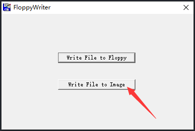

## 本页目录

[[toc]]

## Helloworld

### 编写汇编代码

```asm
org  0x7c00 ; 指示 BIOS 加载代码时将程序写到内存的 0x7c00

jmp  entry ; 跳转(如果是函数则调用)，此行代码对应的机器码是 3 字节
db   0x90 ; 0x7c00 + 3 处申请1个字节内存空间写入 0x90
DB   "OSKERNEL" ; 0x7c00 + 3 + 1 处开始申请内存空间写入 OSKERNEL
                ; (连续申请9个字节，字符串结尾会分配一个结束符)
DW   512 ; 申请 2 个字节内存空间写入 512
DB   1
DW   1
DB   2
DW   224
DW   2880
DB   0xf0
DW   9
DW   18
DW   2
DD   0
DD   2880
DB   0,0,0x29
DD   0xFFFFFFFF ; 申请 4 个字节内存空间写入 512
DB   "MYFIRSTOS  "
DB   "FAT12   "
RESB  18 ; 把接下来的18个字节的内存全部初始化为 0

entry:
    mov  ax, 0 ; 将 0 赋值给 ax 寄存器(ax大小 2字节)
    mov  ss, ax
    mov  ds, ax
    mov  es, ax
    mov  si, msg

putloop:
    mov  al, [si] ; al 是 ax 寄存器的低 8 位
    add  si, 1 ; 下一个字节
    cmp  al, 0 ; 如果 al 是 0 执行下行
    je   fin
    mov  ah, 0x0e ; 输出
    mov  bx, 15
    int  0x10 ; 执行
    jmp  putloop

fin:
    HLT
    jmp  fin ; 死循环

msg:
    DB    0x0a,  0x0a ; 输出换行符
    db    "hello, world"
    db    0x0a
    db    0 ; 停止输出
```

### 编译汇编代码

```sh
nasm -o boot.bin helloworld.asm
```

### 创建虚拟软盘

```sh
dd if=/dev/zero of=tmp.img bs=1024 count=1440
```

### 将二进制文件写入软盘

```sh
dd if=boot.bin of=boot.img bs=512 count=1
dd if=tmp.img of=boot.img skip=1 seek=1 bs=512 count=2879
```

或用 windows 平台软件操作

[FloppyWriter](http://ahri-share.oss-cn-beijing.aliyuncs.com/blog/hacker/FloppyWriter.exe)



先选择二进制文件 boot.bin，再选择软盘镜像 boot.img

### 启动系统

Vmware 添加软盘驱动并选择 boot.img，启动
[写好的 boot.img](http://ahri-share.oss-cn-beijing.aliyuncs.com/blog/hacker/boot.img)


## 汇编读软盘

使用汇编读取软盘的原理与上面描述的相同，我们要调用相应的 BIOS 中断，同时将要读取的磁头号，柱面，扇区号传给中断代码，读取软盘的汇编代码如下：

```asm
mov CH, 1 ; CH 存储柱面号
mov DH, 0 ; DH 存储磁头号
mov CL, 2 ; CL 存储扇区号

mov BX, msg ; BX 数据存储缓冲区

mov AH, 0x02 ; AH = 02 表示要做的是读盘操作
mov AL, 1 ; AL 表示要练习读取几个扇区
mov DL, 0 ; 驱动器编号，只有一个软盘驱动器，所以为 0
INT 0x13 ; 调用 BIOS 中断实现磁盘读取功能
JC error ; 如果读盘出现错误，跳转到 error 处执行相应代码
```

在计算机硬件中，有一个隐含的寄存器叫 FLACS, 当 BIOS 调用出现错误时，FLACS 寄存器的 CF 位会置为 1，同时把错误代码存入 AH,如果没有错，那么 FLACS 寄存器的 CF 位会设置为 0

### 读取软盘的汇编代码

将第二扇区的数据读取出来并显示

```asm
org  0x7c00;

entry:
    mov  ax, 0
    mov  ss, ax
    mov  ds, ax
    mov  es, ax
    mov  si, msg

readContent:
    mov  CH, 1
    mov  DH, 0
    mov  CL, 2

    mov  BX, msg

    mov  AH, 0x02
    mov  AL,  1
    mov  DL, 0
    INT  0x13

    jc  error

putloop:
    mov  al, [si]
    add  si, 1
    cmp  al, 0
    je   fin
    mov  ah, 0x0e
    mov  bx, 15
    int  0x10
    jmp  putloop

fin:
    HLT
    jmp  fin

error:
    mov si, errmsg
    jmp   putloop

msg:
    RESB   64
errmsg:
    DB "error"
```

<Valine />
