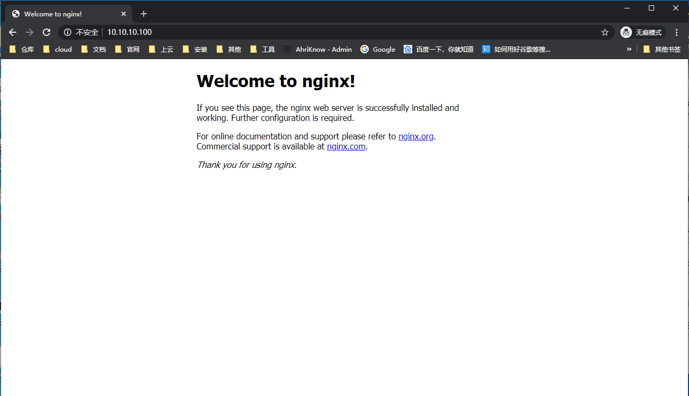

## 本页目录

[[toc]]
::: tip

#### 非 root 用户 请添加 sudo

:::

## 安装

[Nginx 官网](http://nginx.org/)

### 安装依赖

#### yum 安装

```sh
yum install -y make zlib zlib-devel gcc-c++ libtool openssl openssl-devel
```

#### 编译安装 例 PCRE

-   [PCRE](https://sourceforge.net/projects/pcre/files/pcre/)

```sh
tar -zxvf pcre-8.43.tzr.gz -C /usr/src && cd /usr/src/pcre-8.43
./configure
make && make install
```

### 安装 Nginx

```sh
tar -zxvf nginx-1.17.7.tar.gz -C /usr/src && cd /usr/src/nginx-1.17.7
./configure
make && make install
```

### 管理 Nginx

```sh
[root@localhost nginx]# cd /usr/local/nginx/sbin/
[root@localhost sbin]# ls
nginx
[root@localhost sbin]# ./nginx
[root@localhost sbin]# ps -ef | grep nginx
root      10760      1  0 02:47 ?        00:00:00 nginx: master process ./nginx
nobody    10761  10760  0 02:47 ?        00:00:00 nginx: worker process
root      10763   2556  0 02:47 pts/0    00:00:00 grep --color=auto nginx
[root@localhost sbin]#

# 开放 80 端口
[root@localhost sbin]# firewall-cmd --add-service=http --permanent
success
[root@localhost sbin]# firewall-cmd --add-port=80/tcp --permanent
success
[root@localhost sbin]# firewall-cmd --reload
success
[root@localhost sbin]#

# 或 关闭防火墙
[root@localhost sbin]# systemctl stop firewalld
[root@localhost sbin]#
```



## Nginx 常用命令

```sh
cd /usr/local/nginx/sbin
./nginx -v # 版本号
./nginx # 启动
./nginx -s stop # 停止
./nginx -s reload # 热重载
```

<Valine />
