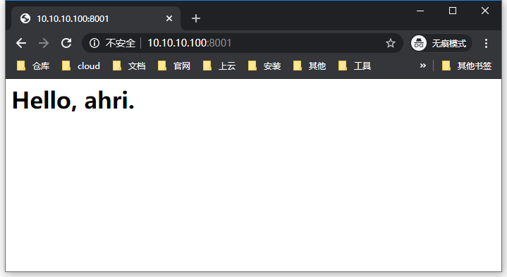

## 本页目录

[[toc]]
::: tip

#### 非 root 用户 请添加 sudo

:::

## 安装

> Docker 的安装及应用详见：[https://docs.ahriknow.com/docker/](https://docs.ahriknow.com/docker/)

### 拉取镜像

```sh
[root@localhost ~]# docker pull nginx
Using default tag: latest
latest: Pulling from library/nginx
8ec398bc0356: Pull complete
dfb2a46f8c2c: Pull complete
b65031b6a2a5: Pull complete
Digest: sha256:8aa7f6a9585d908a63e5e418dc5d14ae7467d2e36e1ab4f0d8f9d059a3d071ce
Status: Downloaded newer image for nginx:latest
docker.io/library/nginx:latest
[root@localhost ~]# docker image ls
REPOSITORY          TAG                 IMAGE ID            CREATED             SIZE
nginx               latest              c7460dfcab50        8 hours ago         126MB
[root@localhost ~]#
```

### 创建启动 nginx 容器

```sh
[root@localhost ~]# docker container run --name nginx1 -p 8000:80 -d nginx
56fe90a79c00262bf22a063773a76b958c40d6459ad314de74d80c9c5f1ede4b
[root@localhost ~]# docker container ls
CONTAINER ID        IMAGE               COMMAND                  CREATED             STATUS              PORTS                  NAMES
56fe90a79c00        nginx               "nginx -g 'daemon of…"   4 minutes ago       Up 4 minutes        0.0.0.0:8000->80/tcp   nginx1
[root@localhost ~]#
```


### 挂载目录到容器

#### 创建本地目录

```sh
[root@localhost ~]# mkdir -p /tmp/nginx/conf.d
[root@localhost ~]# mkdir -p /tmp/nginx/html
[root@localhost ~]# mkdir -p /tmp/nginx/logs
[root@localhost ~]# touch /tmp/nginx/nginx.conf
[root@localhost ~]# tree /tmp/nginx/
/tmp/nginx/
├── conf.d
├── html
└── logs

3 directories, 0 files
[root@localhost ~]#
```

#### 创建配置文件

-   从现有容器中复制出来 (或 重新编写)

```sh
[root@localhost ~]# docker container cp 56fe90a79c00:/etc/nginx/nginx.conf /tmp/nginx/
[root@localhost ~]# docker container cp 56fe90a79c00:/etc/nginx/conf.d/default.conf /tmp/nginx/conf.d/

# 创建 index.html
[root@localhost ~]# echo "<h1>Hello, ahri.</h1>" > /tmp/nginx/html/index.html
[root@localhost ~]# tree /tmp/nginx/
/tmp/nginx/
├── conf.d
│   └── default.conf
├── html
│   └── index.html
├── logs
│   ├── access.log
│   └── error.log
└── nginx.conf

3 directories, 5 files
[root@localhost ~]#
```

#### 创建启动容器

```sh
[root@localhost ~]# docker container run --name nginx2 -p 8001:80 -v /tmp/nginx/nginx.conf:/etc/nginx/nginx.conf -v /tmp/nginx/conf.d:/etc/nginx/conf.d -v /tmp/nginx/html:/usr/share/nginx/html -v /tmp/nginx/logs:/var/log/nginx -d nginx
12e2142ab074f67ec1b098888542261d659cd44e7b1b8a511bf93b86593448a9
[root@localhost ~]# docker container ls
CONTAINER ID        IMAGE               COMMAND                  CREATED             STATUS              PORTS                  NAMES
12e2142ab074        nginx               "nginx -g 'daemon of…"   6 seconds ago       Up 6 seconds        0.0.0.0:8001->80/tcp   nginx2
56fe90a79c00        nginx               "nginx -g 'daemon of…"   10 minutes ago      Up 10 minutes       0.0.0.0:8000->80/tcp   nginx1
[root@localhost ~]#
```



<Valine />
