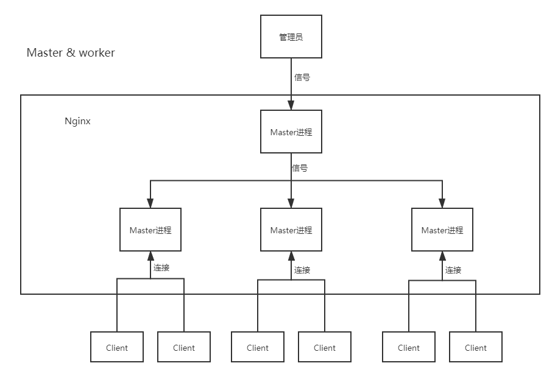

## 本页目录

[[toc]]

## Master & worker

#### 原理图



#### nginx 进程

```sh
[root@localhost ~]# ps -ef | grep nginx
# master
root       3401      1  0 04:28 ?        00:00:00 nginx: master process /usr/sbin/nginx -c /etc/nginx/nginx.conf
# worker 可以多个
nginx      3402   3401  0 04:28 ?        00:00:00 nginx: worker process

root       3406   1968  0 04:48 pts/0    00:00:00 grep --color=auto nginx
[root@localhost ~]#
```

#### master 工作原理


#### master&worker 优点

-   使用 `nginx -s reload` 热部署
-   每个 worker 是独立的进程，其中一个出现问题，不会造成服务中断

#### worker 的个数

Nginx 和 redis 类似，都采用了 io 多路复用，每个 worker 都是一个独立的进程，但每个进程里只有一个主线程，通过异步非阻塞的方式来处理请求。

每个 worker 可以将一个 cpu 的性能发挥到极致，所以 worker 数和 cpu 数相等是最适宜的。

Windows 系统没有 io 多路复用及至。

#### 设置 worker 的个数

```sh
worker_processes  4; # 自动
# 或
worker_cpu_affinity 0001 0010 0100 1000; # 4 个 cpu 绑定 4 个
worker_cpu_affinity 00000001 00000010 00000100 00001000; # 8 个 cpu 绑定 4 个
```

#### worker 连接数

每个 worker 的最大连接数是 1024

worker 处理一个请求，占用 2 个或 4 个 连接数（静态 2 个，其他服务又 2 个）

1 个 master，4 个 worker，支持的最大并发量是 $4*1024/2$ 或 $4*1024/4$

<Valine />
