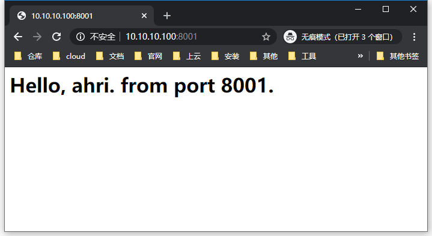

## 本页目录

[[toc]]

## 前置环境

#### 在本地 host 文件添加映射

`10.10.10.100 fox.com`

`10.10.10.100 ahri.com`

#### 准备 nginx 目录结构

```sh
[root@localhost ~]# tree /tmp/nginx/
/tmp/nginx/
├── n80
│   ├── conf.d
│   │   └── default.conf
│   ├── html
│   │   └── index.html
│   └── nginx.conf
├── n8001
│   ├── conf.d
│   │   └── default.conf
│   ├── html
│   │   └── index.html
│   └── nginx.conf
└── n8002
    ├── conf.d
    │   └── default.conf
    ├── html
    │   └── index.html
    └── nginx.conf

9 directories, 9 files
[root@localhost ~]# cat /tmp/nginx/n80/html/index.html
<h1>Hello, ahri. from port 80.</h1>
[root@localhost ~]# cat /tmp/nginx/n8001/html/index.html
<h1>Hello, ahri. from port 8001.</h1>
[root@localhost ~]# cat /tmp/nginx/n8002/html/index.html
<h1>Hello, ahri. from port 8002.</h1>
[root@localhost ~]#
```

#### 启动 nginx 容器

```sh
[root@localhost ~]# docker container run --name n80 -p 80:80 -v /tmp/nginx/n80/nginx.conf:/etc/nginx/nginx.conf -v /tmp/nginx/n80/conf.d:/etc/nginx/conf.d -v /tmp/nginx/n80/html:/usr/share/nginx/html -d nginx
65fe8597a21afdbfa6e2e32dcca5c21ec1ffd4c091575badd510ec19e53abe26
[root@localhost ~]# docker container run --name n8001 -p 8001:80 -v /tmp/nginx/n8001/nginx.conf:/etc/nginx/nginx.conf -v /tmp/nginx/n8001/conf.d:/etc/nginx/conf.d -v /tmp/nginx/n8001/html:/usr/share/nginx/html -d nginx
eb5ebab8a5b8321b579b8980cb1d57871b8dc62a5095f6f5e4ac70300d27294a
[root@localhost ~]# docker container run --name n8002 -p 8002:80 -v /tmp/nginx/n8002/nginx.conf:/etc/nginx/nginx.conf -v /tmp/nginx/n8002/conf.d:/etc/nginx/conf.d -v /tmp/nginx/n8002/html:/usr/share/nginx/html -d nginx
73d0688adbd5629ef07fd0556bd0b23fd1dd90fbbf6578e865ecf7bfa44f5d42
[root@localhost ~]# docker container ls -a
CONTAINER ID        IMAGE               COMMAND                  CREATED             STATUS              PORTS                  NAMES
73d0688adbd5        nginx               "nginx -g 'daemon of…"   6 seconds ago       Up 6 seconds        0.0.0.0:8002->80/tcp   n8002
eb5ebab8a5b8        nginx               "nginx -g 'daemon of…"   25 seconds ago      Up 24 seconds       0.0.0.0:8001->80/tcp   n8001
65fe8597a21a        nginx               "nginx -g 'daemon of…"   48 seconds ago      Up 47 seconds       0.0.0.0:80->80/tcp     n80
[root@localhost ~]#
```





## 编辑 Nginx 配置文件

### 实例 1

```sh
# 添加 server 块配置
[root@localhost ~]# vim /tmp/nginx/n80/conf.d/default.conf

server {
        listen       80;
        server_name  ahri.com;

        location / {
            proxy_pass  http://10.10.10.100:8001;
        }
}

[root@localhost ~]# docker container restart n80
n80
[root@localhost ~]#
```


### 实例 2

#### location 指令说明

| 指令 | 说明                                                               |
| ---- | ------------------------------------------------------------------ |
| `=`  | 用于不含正则的 uri 前，请求字符串与 uri 严格匹配                   |
| `^~` | 用于不含正则的 uri 前，找到与 uri 匹配度最高的 location 来处理请求 |
| `~`  | 用于包含正则的 uri 前，区分大小写                                  |
| `~*` | 用于包含正则的 uri 前，不区分大小写                                |

::: warning 注意

uri 中包含正则，必须有 `~` 或 `~*`。

:::

```sh
# 添加 server 块配置
[root@localhost sbin]# vim /tmp/nginx/n80/conf.d/proxy.conf

server {
        listen       80;
        server_name  fox.com;

        # 相当于访问 http://10.10.10.100:8001/8001
        location ~ /8001/ {
            proxy_pass  http://10.10.10.100:8001;
        }

        # 相当于访问 http://10.10.10.100:8002/8002
        location ~ /8002/ {
            proxy_pass  http://10.10.10.100:8002;
        }
}


[root@localhost ~]#  docker container restart n80
n80
[root@localhost ~]# mkdir /tmp/nginx/n8001/html/8001
[root@localhost ~]# echo "8001" > /tmp/nginx/n8001/html/8001/index.html
[root@localhost ~]# mkdir /tmp/nginx/n8002/html/8002
[root@localhost ~]# echo "8002" > /tmp/nginx/n8002/html/8002/index.html
[root@localhost ~]#
```


<Valine />
