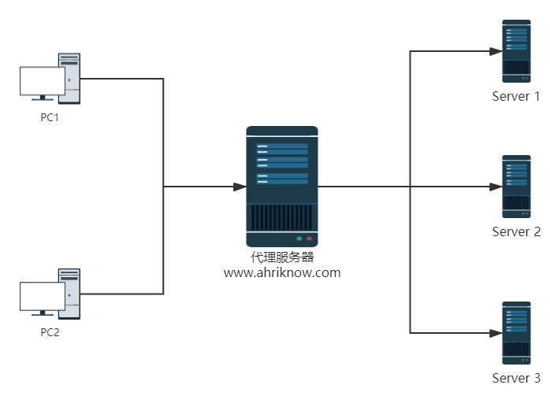
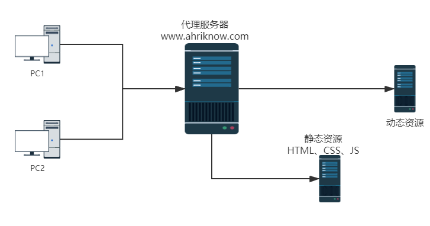

## 本页目录

[[toc]]

## 什么是 Nginx

[百度百科](https://baike.baidu.com/item/nginx/3817705?fr=aladdin)

-   Nginx 是一个高性能的 HTTP 和 反向代理 服务器，特点是占用内存少，并发能力强。

-   Nginx 专为性能优化而开发，性能是其最重要的考量，实现上非常注重效率，能经受高负载的考验，经测试并发数量达到 5W+。

#### nginx 做为 HTTP 服务器，有以下几项基本特性：

> [https://lnmp.org/nginx.html](https://lnmp.org/nginx.html)

-   处理静态文件，索引文件以及自动索引；打开文件描述符缓冲
-   无缓存的反向代理加速，简单的负载均衡和容错
-   FastCGI，简单的负载均衡和容错
-   模块化的结构。包括 gzipping, byte ranges, chunked responses,以及 SSI-filter 等 filter。如果由 FastCGI 或其它代理服务器处理单页中存在的多个 SSI，则这
-   项处理可以并行运行，而不需要相互等待
-   支持 SSL 和 TLSSNI

## Nginx 应用

### 反向代理

-   正向代理

    正向代理，是一个位于客户端和原始服务器(origin server)之间的服务器，为了从原始服务器取得内容，客户端向代理发送一个请求并指定目标(原始服务器)，然后代理向原始服务器转交请求并将获得的内容返回给客户端。客户端才能使用正向代理
    

-   反向代理

    反向代理服务器位于用户与目标服务器之间，但是对于用户而言，反向代理服务器就相当于目标服务器，即用户直接访问反向代理服务器就可以获得目标服务器的资源。同时，用户不需要知道目标服务器的地址，也无须在用户端作任何设定。反向代理服务器通常可用来作为 Web 加速，即使用反向代理作为 Web 服务器的前置机来降低网络和服务器的负载，提高访问效率
    

### 负载均衡

负载均衡（Load Balance）其意思就是分摊到多个操作单元上进行执行，例如 Web 服务器、FTP 服务器、企业关键应用服务器和其它关键任务服务器等，从而共同完成工作任务

增加服务器的数量，然后将请求分发到各个服务器上，将负载分发到不同的服务器

### 动静分离

动静分离是指在 web 服务器架构中，将静态页面与动态页面或者静态内容接口和动态内容接口分开不同系统访问的架构设计方法，进而提升整个服务访问性能和可维护性

为了加快网站的解析速度，可以把动态页面和静态页面由不同的服务器来解析，加快解析速度，降低单个服务器的压力

### 高可用

-   计算机的高可用性

计算机系统的可用性用平均无故障时间（MTTF）来度量，即计算机系统平均能够正常运行多长时间，才发生一次故障。系统的可用性越高，平均无故障时间越长。可维护性用平均维修时间（MTTR）来度量，即系统发生故障后维修和重新恢复正常运行平均花费的时间。系统的可维护性越好，平均维修时间越短。计算机系统的可用性定义为：MTTF/(MTTF+MTTR) \* 100%。由此可见，计算机系统的可用性定义为系统保持正常运行时间的百分比。

-   负载均衡服务器的高可用性

为了屏蔽负载均衡服务器的失效，需要建立一个备份机。主服务器和备份机上都运行 High Availability 监控程序，通过传送诸如“I am alive”这样的信息来监控对方的运行状况。当备份机不能在一定的时间内收到这样的信息时，它就接管主服务器的服务 IP 并继续提供服务；当备份管理器又从主管理器收到“I am alive”这样的信息时，它就释放服务 IP 地址，这样的主管理器就开始再次进行集群管理的工作了。为在主服务器失效的情况下系统能正常工作，我们在主、备份机之间实现负载集群系统配置信息的同步与备份，保持二者系统的基本一致

<Valine />
