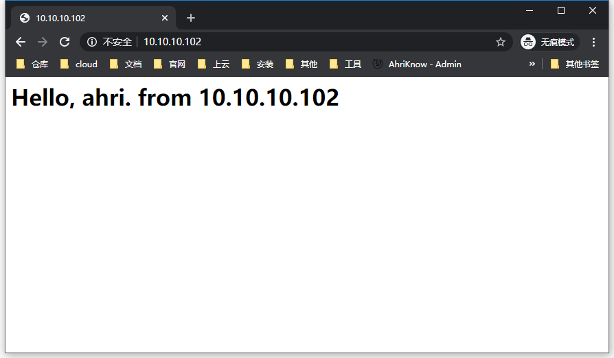
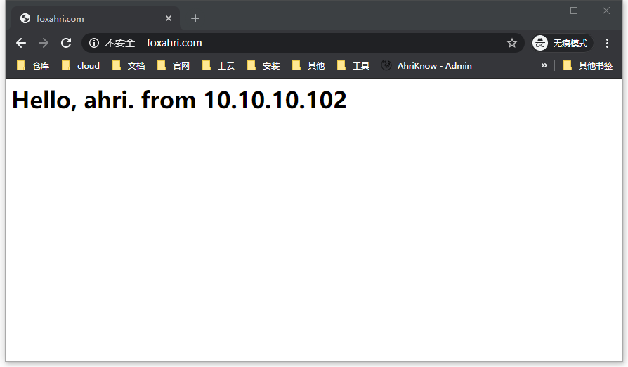

## 本页目录

[[toc]]

## 前置环境

#### 在本地 host 文件添加映射

`10.10.10.110 foxahri.com`

#### 准备 nginx 目录结构

```sh
10.10.10.110 # 虚拟 ip
10.10.10.101 # master ip
10.10.10.102 # backup ip
10.10.10.100 # server ip

# 10.10.10.100
[root@localhost ~]# tree /tmp/nginx/
/tmp/nginx/
├── conf.d
│   └── default.conf
└── html
    └── index.html

2 directories, 2 files
[root@localhost ~]# cat /tmp/nginx/html/index.html
<h1>Hello, ahri.</h1>
[root@localhost ~]# docker container run --name n80 -p 80:80 -v /tmp/nginx/conf.d:/etc/nginx/conf.d -v /tmp/nginx/html:/usr/share/nginx/html -d nginx
b7cd51db27eef571f6018ad45d0bb7d31fd643f4c9227625543e39ba36a17f00
[root@localhost ~]# docker container ps -a
CONTAINER ID        IMAGE               COMMAND                  CREATED             STATUS              PORTS                NAMES
b7cd51db27ee        nginx               "nginx -g 'daemon of…"   19 seconds ago      Up 18 seconds       0.0.0.0:80->80/tcp   n80
[root@localhost ~]#


# 10.10.10.101 和 10.10.10.102 安装启动 nginx
[root@localhost ~]# sudo rpm -Uvh http://nginx.org/packages/centos/7/noarch/RPMS/nginx-release-centos-7-0.el7.ngx.noarch.rpm
Retrieving http://nginx.org/packages/centos/7/noarch/RPMS/nginx-release-centos-7-0.el7.ngx.noarch.rpm
warning: /var/tmp/rpm-tmp.644lyb: Header V4 RSA/SHA1 Signature, key ID 7bd9bf62: NOKEY
Preparing...                          ################################# [100%]
Updating / installing...
   1:nginx-release-centos-7-0.el7.ngx ################################# [100%]
[root@localhost ~]# yum install nginx -y
......
[root@localhost ~]# vim /etc/nginx/conf.d/default.conf
server {
    listen       80;
    server_name  foxahri.com;

    location / {
        root   /usr/share/nginx/html;
        index  index.html index.htm;
    }
}
[root@localhost ~]# systemctl start nginx
[root@localhost ~]#


# 10.10.10.101
[root@localhost ~]# echo "<h1>Hello, ahri. from 10.10.10.101</h1>" > /usr/share/nginx/html/index.html
[root@localhost ~]#


# 10.10.10.102
[root@localhost ~]# echo "<h1>Hello, ahri. from 10.10.10.102</h1>" > /usr/share/nginx/html/index.html
[root@localhost ~]#
```




## 配置高可用集群

#### 集群原理


#### 安装 keepalived

```sh
# 10.10.10.101 和 10.10.10.102 安装
yum install keepalived -y
```

#### 更改 keepalived 配置

-   [MASTER 完整配置](#master)
-   [BACKUP 完整配置](#backup)

```sh
[root@localhost ~]# vim /etc/keepalived/keepalived.conf

# 添加
vrrp_script chk_http_port {
    script "/usr/local/src/nginx_check.sh"
    interval 2
    weight 2
}


# MASTER
vrrp_instance VI_1 {
    state MASTER # 主机为 MASTER，备份机为 BACKUP
    interface ens33 # 网卡名
    virtual_router_id 51 # 虚拟路由 id，主备必须相同
    priority 100 # 优先级，MASTER 较大，BACKUP 较小
    advert_int 1
    authentication {
        auth_type PASS
        auth_pass 1111
    }
    virtual_ipaddress {
        10.10.10.110 # 虚拟 ip
    }
}

# BACKUP
vrrp_instance VI_1 {
    state BACKUP
    interface ens33
    virtual_router_id 51
    priority 90
    advert_int 1
    authentication {
        auth_type PASS
        auth_pass 1111
    }
    virtual_ipaddress {
        10.10.10.110
    }
}

[root@localhost ~]#
```

#### 新建 nginx_check.sh 脚本

```sh
[root@localhost ~]# whereis nginx
nginx: /usr/sbin/nginx /usr/lib64/nginx /etc/nginx /usr/local/nginx /usr/share/nginx /usr/share/man/man8/nginx.8.gz
[root@localhost ~]#
```

```sh
#!/bin/bash

A=`ps -C nginx --no-header | wc -l`
if [ $A -eq 0 ];then
        /usr/sbin/nginx
        sleep 2
        if [ `ps -C nginx --no-header | wc -l` -eq 0 ];then
                killall keepalived
        fi
fi
```

#### 启动 keepalived

```sh
[root@localhost ~]# systemctl start keepalived
[root@localhost ~]# systemctl status keepalived
● keepalived.service - LVS and VRRP High Availability Monitor
   Loaded: loaded (/usr/lib/systemd/system/keepalived.service; disabled; vendor preset: disabled)
   Active: active (running) since Mon 2020-01-13 04:10:28 EST; 7s ago
  Process: 3314 ExecStart=/usr/sbin/keepalived $KEEPALIVED_OPTIONS (code=exited, status=0/SUCCESS)
 Main PID: 3315 (keepalived)
    Tasks: 3
   Memory: 1.7M
   CGroup: /system.slice/keepalived.service
           ├─3315 /usr/sbin/keepalived -D
           ├─3316 /usr/sbin/keepalived -D
           └─3317 /usr/sbin/keepalived -D

Jan 13 04:10:32 localhost.localdomain Keepalived_vrrp[3317]: VRRP_Instance(VI_1) Transition to MASTER STATE
Jan 13 04:10:33 localhost.localdomain Keepalived_vrrp[3317]: VRRP_Instance(VI_1) Entering MASTER STATE
Jan 13 04:10:33 localhost.localdomain Keepalived_vrrp[3317]: VRRP_Instance(VI_1) setting protocol iptable drop rule
Jan 13 04:10:33 localhost.localdomain Keepalived_vrrp[3317]: VRRP_Instance(VI_1) setting protocol VIPs.
Jan 13 04:10:33 localhost.localdomain Keepalived_vrrp[3317]: Sending gratuitous ARP on ens33 for 10.10.10.110
Jan 13 04:10:33 localhost.localdomain Keepalived_vrrp[3317]: VRRP_Instance(VI_1) Sending/queueing gratuitous ARPs on ens33 for 10.10.10.110
Jan 13 04:10:33 localhost.localdomain Keepalived_vrrp[3317]: Sending gratuitous ARP on ens33 for 10.10.10.110
Jan 13 04:10:33 localhost.localdomain Keepalived_vrrp[3317]: Sending gratuitous ARP on ens33 for 10.10.10.110
Jan 13 04:10:33 localhost.localdomain Keepalived_vrrp[3317]: Sending gratuitous ARP on ens33 for 10.10.10.110
Jan 13 04:10:33 localhost.localdomain Keepalived_vrrp[3317]: Sending gratuitous ARP on ens33 for 10.10.10.110
[root@localhost ~]#


[root@localhost ~]# ip a
1: lo: <LOOPBACK,UP,LOWER_UP> mtu 65536 qdisc noqueue state UNKNOWN group default qlen 1000
    link/loopback 00:00:00:00:00:00 brd 00:00:00:00:00:00
    inet 127.0.0.1/8 scope host lo
       valid_lft forever preferred_lft forever
    inet6 ::1/128 scope host
       valid_lft forever preferred_lft forever
2: ens33: <BROADCAST,MULTICAST,UP,LOWER_UP> mtu 1500 qdisc pfifo_fast state UP group default qlen 1000
    link/ether 00:0c:29:50:55:db brd ff:ff:ff:ff:ff:ff
    inet 10.10.10.101/24 brd 10.10.10.255 scope global noprefixroute ens33 # 虚拟 ip
       valid_lft forever preferred_lft forever
    inet 10.10.10.110/32 scope global ens33
       valid_lft forever preferred_lft forever
    inet6 fe80::5eb3:7b78:302e:ef03/64 scope link tentative noprefixroute dadfailed
       valid_lft forever preferred_lft forever
    inet6 fe80::a7a1:e184:be7f:58d8/64 scope link noprefixroute
       valid_lft forever preferred_lft forever
[root@localhost ~]#

```

#### 访问测试


-   停掉 MASTER

```sh
[root@localhost ~]# systemctl stop keepalived
[root@localhost ~]# systemctl stop nginx
[root@localhost ~]#
```



-   再启动 MASTER

```sh
[root@localhost ~]# systemctl start nginx
[root@localhost ~]# systemctl start keepalived
[root@localhost ~]#
```


#### 代理 Server

```sh
# 10.10.10.101 和 10.10.10.102
[root@localhost ~]# vim /etc/nginx/conf.d/default.conf
server {
    listen       80;
    server_name  localhost;

    location / {
        proxy_pass      http://10.10.10.100;
    }
}
[root@localhost ~]# systemctl restrt nginx
[root@localhost ~]#
```


## 附录

<span id="master"></span>

-   master 完整配置

```sh
! Configuration File for keepalived

global_defs {
   notification_email {
     acassen@firewall.loc
     failover@firewall.loc
     sysadmin@firewall.loc
   }
   notification_email_from Alexandre.Cassen@firewall.loc
   smtp_server 192.168.200.1
   smtp_connect_timeout 30
   router_id LVS_DEVEL
   vrrp_skip_check_adv_addr
   vrrp_strict
   vrrp_garp_interval 0
   vrrp_gna_interval 0
}

vrrp_script chk_http_port {
    script "/usr/local/src/nginx_check.sh"
    interval 2
    weight 2
}

vrrp_instance VI_1 {
    state MASTER
    interface ens33
    virtual_router_id 51
    priority 100
    advert_int 1
    authentication {
        auth_type PASS
        auth_pass 1111
    }
    virtual_ipaddress {
        10.10.10.110
    }
}
```

<span id="backup"></span>

-   backup 完整配置

```sh
! Configuration File for keepalived

global_defs {
   notification_email {
     acassen@firewall.loc
     failover@firewall.loc
     sysadmin@firewall.loc
   }
   notification_email_from Alexandre.Cassen@firewall.loc
   smtp_server 192.168.200.1
   smtp_connect_timeout 30
   router_id LVS_DEVEL
   vrrp_skip_check_adv_addr
   vrrp_strict
   vrrp_garp_interval 0
   vrrp_gna_interval 0
}

vrrp_script chk_http_port {
    script "/usr/local/src/nginx_check.sh"
    interval 2
    weight 2
}

vrrp_instance VI_1 {
    state BACKUP
    interface ens33
    virtual_router_id 51
    priority 90
    advert_int 1
    authentication {
        auth_type PASS
        auth_pass 1111
    }
    virtual_ipaddress {
        10.10.10.110
    }
}
```

<Valine />
